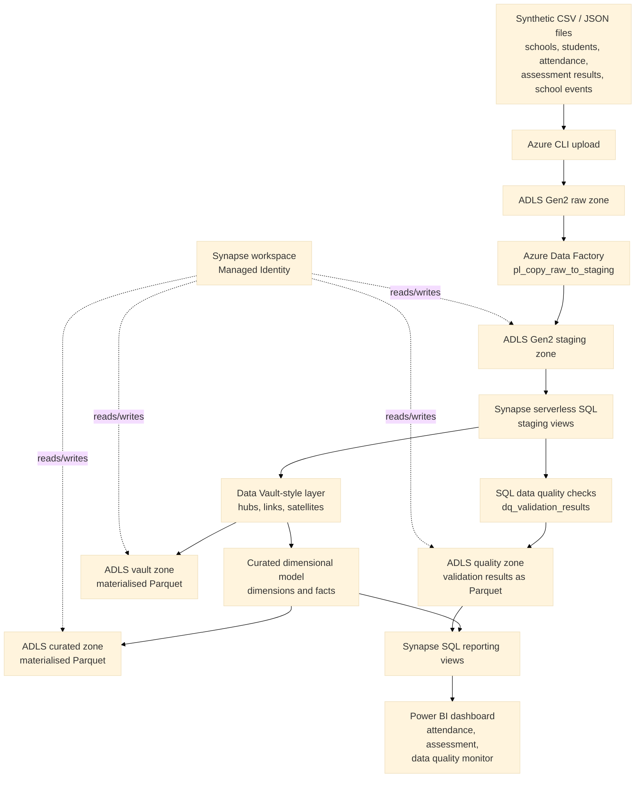

# Architecture

## Overview

This project implements a small Azure education data lakehouse using synthetic school, student, attendance, assessment, and school event data.

The final architecture uses ADLS Gen2 for lake storage, Azure Data Factory for raw-to-staging movement, Synapse serverless SQL for staging, quality checks, lakehouse materialisation, and reporting views, and Power BI for dashboarding.

## Architecture Diagram



## Implemented Azure Resources

| Resource | Name | Purpose |
|---|---|---|
| Resource group | `rg-act-education-lakehouse-dev` | Groups all Azure resources for the project |
| Storage account | `stactedulakehousechien` | Stores lakehouse files |
| ADLS Gen2 file system | `education-data-lake` | Main data lake container |
| Azure Data Factory | Project ADF resource | Orchestrates raw-to-staging copy pipeline |
| ADF linked service | `ls_adls_education_lakehouse` | Connects ADF to ADLS Gen2 |
| ADF pipeline | `pl_copy_raw_to_staging` | Copies raw files to staging folders |
| Synapse workspace | `syn-act-education-lakehouse-dev` | Hosts serverless SQL objects |
| Synapse database | `act_education_lakehouse` | Contains staging, quality, vault, curated, and reporting SQL objects |
| Power BI report | `powerbi/dashboard.pbix` | Presents attendance, assessment, and data quality outputs |

## Implemented Data Flow

1. Synthetic CSV and JSON files are generated locally.
2. Source files are uploaded to the ADLS Gen2 raw zone using Azure CLI.
3. Azure Data Factory copies files from raw folders to staging folders.
4. Synapse serverless SQL staging views read staged files using a Managed Identity-backed external data source.
5. SQL data quality checks create a validation summary.
6. Quality results are materialised to the ADLS quality zone as Parquet.
7. Lightweight Data Vault-style hubs, links, and satellites are materialised to the ADLS vault zone as Parquet.
8. Curated dimensions and facts are materialised to the ADLS curated zone as Parquet.
9. Synapse reporting views expose Power BI-ready attendance, assessment, and quality metrics.
10. Power BI imports the reporting views and provides overview and detail pages.

## Lakehouse Folder Structure

```text
education-data-lake/
  raw/
    schools/
    students/
    attendance/
    assessment_results/
    school_events/
  staging/
    stg_schools/
    stg_students/
    stg_attendance/
    stg_assessment_results/
    stg_school_events/
  quality/
    validation_results/
  vault/
    hubs/
    links/
    satellites/
  curated/
    dimensions/
    facts/
```

## Security and Access

Synapse serverless SQL uses the Synapse workspace Managed Identity to access ADLS Gen2 through the external data source `education_lake`.

This avoids embedding storage keys in SQL scripts and makes Power BI access through Synapse reporting views cleaner.

## Scope Notes

- The original synthetic files are uploaded to the raw zone using Azure CLI.
- Azure Data Factory demonstrates the ingestion/orchestration pattern by copying raw files into the staging zone.
- The project is batch-oriented and intentionally small.
- Production extensions would include private endpoints, Key Vault, CI/CD, monitoring, alerting, metadata-driven ingestion, and stronger governance controls.

## Evidence

| Evidence | Location |
|---|---|
| Resource group screenshot | `images/resource_group.png` |
| Storage account screenshot | `images/storage_account.png` |
| Storage folder screenshot | `images/storage_folders.png` |
| ADF resource screenshot | `images/adf_resource.png` |
| ADF datasets screenshot | `adf/pipeline_screenshots/adf_datasets.png` |
| ADF pipeline canvas screenshot | `adf/pipeline_screenshots/adf_pipeline_canvas.png` |
| ADF successful run screenshot | `adf/pipeline_screenshots/adf_pipeline_success.png` |
| Synapse resource screenshot | `images/synapse_resource.png` |
| Synapse query screenshot | `images/synapse_query.png` |
| Data quality result screenshot | `images/dq_validation_results.png` |
| Power BI report | `powerbi/dashboard.pbix` |
| Power BI screenshots | `powerbi/screenshots/` |
