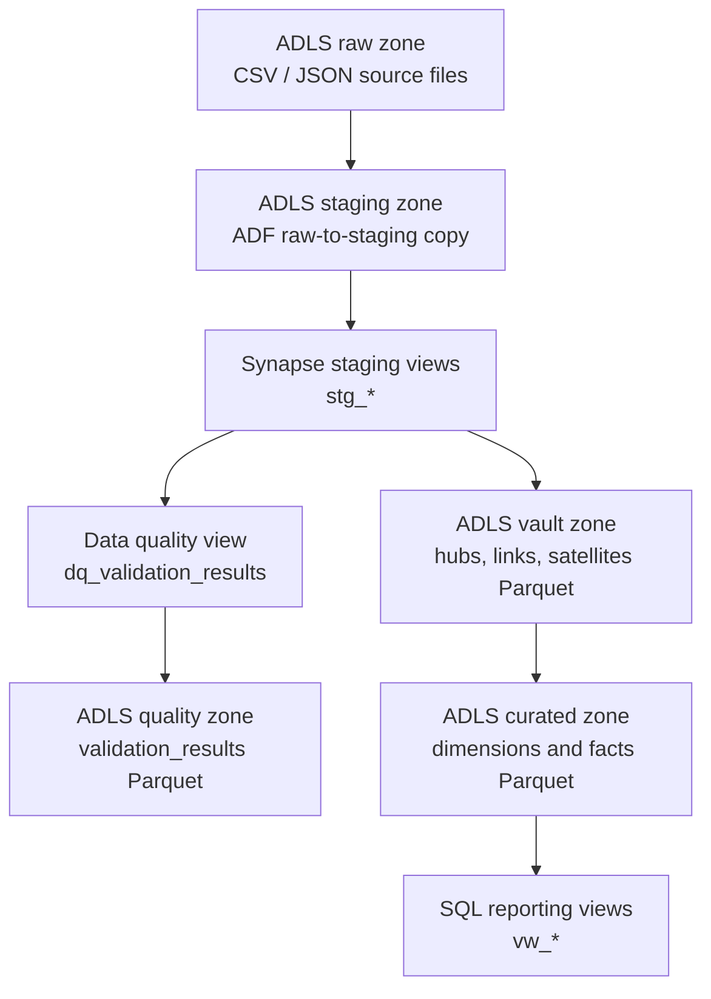
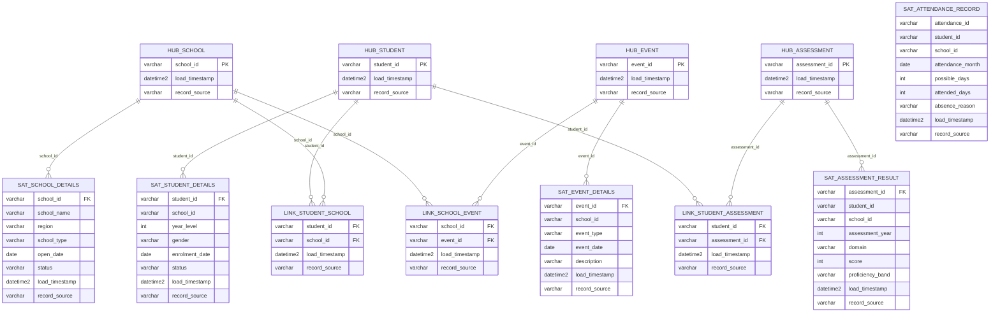
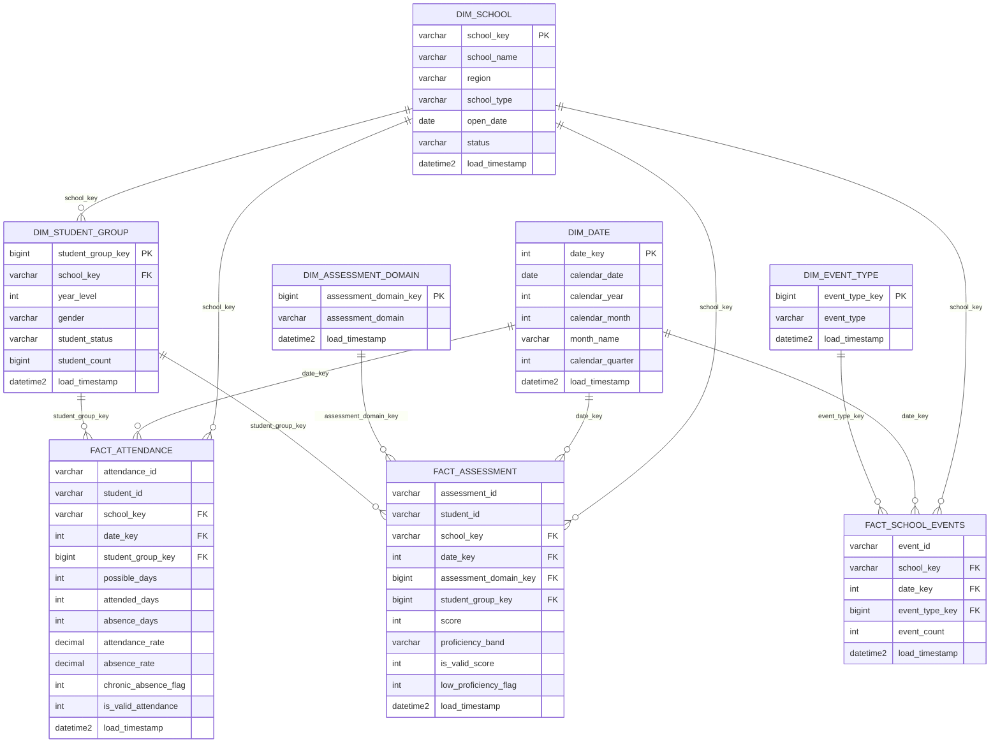

# Data Model Diagram

## Overview

This project uses three modelling layers after ingestion:

1. Staging views over ADLS Gen2 staged files.
2. A lightweight Data Vault layer materialised to ADLS Gen2 as Parquet.
3. A curated dimensional model materialised to ADLS Gen2 as Parquet and exposed through SQL reporting views.

## Lakehouse Modelling Flow

## Lightweight Data Vault Model

## Curated Dimensional Model

## Reporting Views

| View | Purpose |
|---|---|
| `vw_attendance_by_school` | Attendance rate and absence metrics by school and month |
| `vw_attendance_by_year_level` | Attendance metrics by school, year level, gender, and student status |
| `vw_assessment_by_school` | Assessment outcomes by school, year, and domain |
| `vw_assessment_by_domain` | Assessment outcomes by year and domain |
| `vw_data_quality_summary` | Data quality results for monitoring and reporting |

## Modelling Notes

- Staging views standardise source files and preserve source lineage.
- The Data Vault layer keeps business keys, relationships, and descriptive details separated.
- The curated layer is stricter than the vault layer and is designed for reporting.
- Invalid measure values are retained in some facts with validity flags, while orphan key records are excluded from reporting facts.
- `dim_student_group` is used instead of an individual `dim_student` to keep reporting aggregated and privacy-aware.
