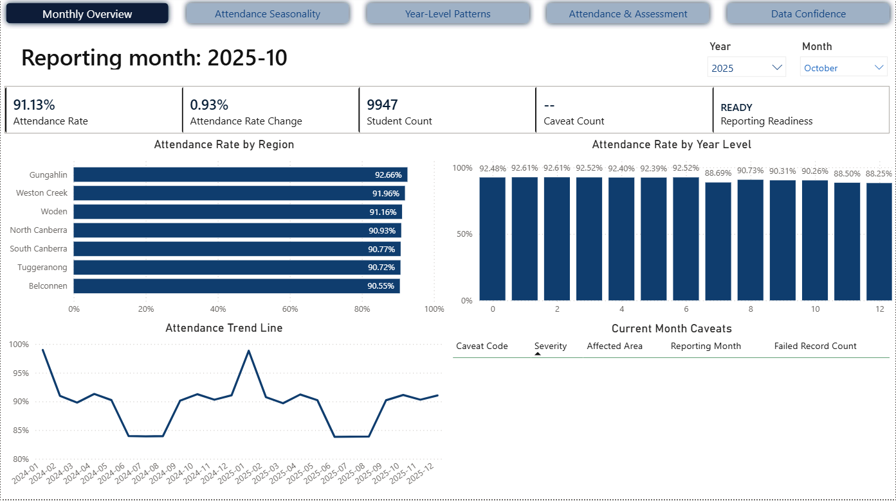

# Monthly Education Insights Brief - October 2025

## Reporting Period

| Field | Value |
|---|---|
| Reporting month | October 2025 |
| Prepared for | Education reporting and school operations stakeholders |
| Prepared by | Pipeline C portfolio project |
| Data status | Ready |

## Executive Summary

October continues the post-winter recovery. Attendance rises to 91.13%, up 0.93 percentage points from September. No current-month caveats are shown, so the month is ready for reporting.

## Key Findings

| Finding | Evidence | Why it matters |
|---|---|---|
| Attendance continues to improve | Attendance rate is 91.13% | October confirms that recovery after winter has been sustained. |
| Regional attendance is consistently strong | All regions are above 90% | The improvement is broad across regions. |
| No caveats are shown | Caveat count is 0 | Reporting confidence is higher than in August and September. |

## Movement From Prior Period

| Metric | Current period | Prior period | Movement | Interpretation |
|---|---:|---:|---:|---|
| Attendance rate | 91.13% | 90.20% | +0.93 pp | Continued improvement after September. |
| Low attendance student share | To be added | To be added | To be added | Not shown in the monthly overview screenshot. |
| Average assessment score | To be added | To be added | To be added | Not shown in the monthly overview screenshot. |
| Caveat count | 0 | 1 | -1 | Data confidence improved compared with September. |

## Cohorts Or Schools Requiring Attention

| Area | Signal | Suggested follow-up |
|---|---|---|
| Years 11-12 | Lower than most other year levels, despite improvement | Continue targeted monitoring for senior secondary attendance. |
| Belconnen | Lowest regional attendance at 90.55% | Monitor but no immediate caveat is indicated. |

## Attendance And Assessment Insight

The monthly overview screenshot does not show assessment outcomes. Use the Attendance And Assessment page to add the attendance-to-assessment interpretation later.

## Data Quality Caveats

| Caveat | Impact on reporting | Treatment |
|---|---|---|
| None shown for the current month | No caveat impact identified from the screenshot | Report as ready. |

Reporting confidence:

Reporting can proceed without current-month caveats.

## Recommended Actions

| Action | Owner | Timing |
|---|---|---|
| Use October as a clean post-winter reporting month | Reporting stakeholders | Now |
| Keep senior secondary attendance visible in routine reporting | School operations/reporting stakeholders | Ongoing |
| Compare November movement against October to identify late-year softening | Reporting stakeholders | Next month |

## Dashboard Pages Used

| Dashboard page | Used for |
|---|---|
| Monthly Summary | Overall movement, student count, readiness, regional attendance, year-level attendance, and current-month caveats |
| Attendance Seasonality | Seasonal attendance pattern |
| Year-Level Patterns | Cohort-specific attendance signals |
| Attendance And Assessment | To be added if assessment findings are included |
| Data Quality Caveats | Reporting confidence and limitations |

## Plain-English Close

October is a strong reporting month. Attendance improved again, regional results are broadly consistent, and no caveats are shown for the current month.

## Notes For Portfolio Review

This brief is based on synthetic data generated for a portfolio project. The purpose is to demonstrate monthly reporting, stakeholder communication, data quality caveats, and Power BI storytelling. Student-level identifiers are not shown in stakeholder-facing outputs.
