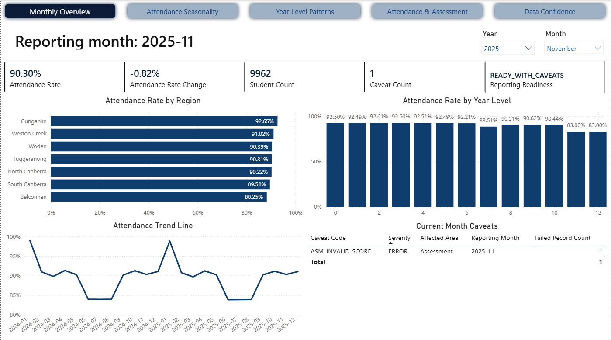

# Monthly Education Insights Brief - November 2025

## Reporting Period

| Field | Value |
|---|---|
| Reporting month | November 2025 |
| Prepared for | Education reporting and school operations stakeholders |
| Prepared by | Pipeline C portfolio project |
| Data status | Ready with caveats |

## Executive Summary

November shows a small softening after October. Attendance is 90.30%, down 0.82 percentage points from the prior month. Reporting remains suitable, but one assessment score caveat should be noted.

## Key Findings

| Finding | Evidence | Why it matters |
|---|---|---|
| Attendance remains above 90% | Attendance rate is 90.30% | Attendance remains stronger than the winter period. |
| Attendance declined from October | Attendance rate change is -0.82 pp | This suggests late-year attendance should continue to be monitored. |
| One assessment caveat is present | `ASM_INVALID_SCORE`, 1 failed record | Assessment interpretation should note that one invalid score was identified. |

## Movement From Prior Period

| Metric | Current period | Prior period | Movement | Interpretation |
|---|---:|---:|---:|---|
| Attendance rate | 90.30% | 91.13% | -0.82 pp | Slight decline after October. |
| Low attendance student share | To be added | To be added | To be added | Not shown in the monthly overview screenshot. |
| Average assessment score | To be added | To be added | To be added | Not shown in the monthly overview screenshot. |
| Caveat count | 1 | 0 | +1 | Data confidence is slightly lower than October due to one assessment caveat. |

## Cohorts Or Schools Requiring Attention

| Area | Signal | Suggested follow-up |
|---|---|---|
| Years 11-12 | Attendance remains lower than most other year levels | Continue senior secondary monitoring before end-of-year reporting. |
| Belconnen | Lowest regional attendance at 88.25% | Review whether the regional decline requires follow-up. |
| Assessment data | Invalid score caveat | Confirm invalid assessment record is excluded or clearly caveated. |

## Attendance And Assessment Insight

The broader dashboard shows that higher attendance bands are associated with stronger assessment outcomes. For November, the assessment caveat means any assessment interpretation should acknowledge that one invalid score was identified and treated as a data-quality issue.

## Data Quality Caveats

| Caveat | Impact on reporting | Treatment |
|---|---|---|
| Invalid assessment score | One assessment record affected | Report with caveat; ensure assessment figures exclude or disclose the invalid score treatment. |

Reporting confidence:

Reporting can proceed with a caveat. The attendance story remains clear, but assessment-related reporting should disclose the invalid score issue.

## Recommended Actions

| Action | Owner | Timing |
|---|---|---|
| Monitor late-year attendance softening | School operations/reporting stakeholders | Now |
| Review invalid assessment score handling | Data/reporting team | Now |
| Keep senior secondary attendance as a standing item in monthly reporting | Reporting stakeholders | Ongoing |

## Dashboard Pages Used

| Dashboard page | Used for |
|---|---|
| Monthly Summary | Overall movement, student count, readiness, regional attendance, year-level attendance, and current-month caveats |
| Attendance Seasonality | Seasonal attendance pattern |
| Year-Level Patterns | Cohort-specific attendance signals |
| Attendance And Assessment | Assessment caveat context and attendance-assessment association |
| Data Quality Caveats | Reporting confidence and limitations |

## Plain-English Close

November remains suitable for reporting, with attendance above 90%. The main caution is one assessment data caveat, which should be disclosed when discussing assessment-related results.

## Notes For Portfolio Review

This brief is based on synthetic data generated for a portfolio project. The purpose is to demonstrate monthly reporting, stakeholder communication, data quality caveats, and Power BI storytelling. Student-level identifiers are not shown in stakeholder-facing outputs.
