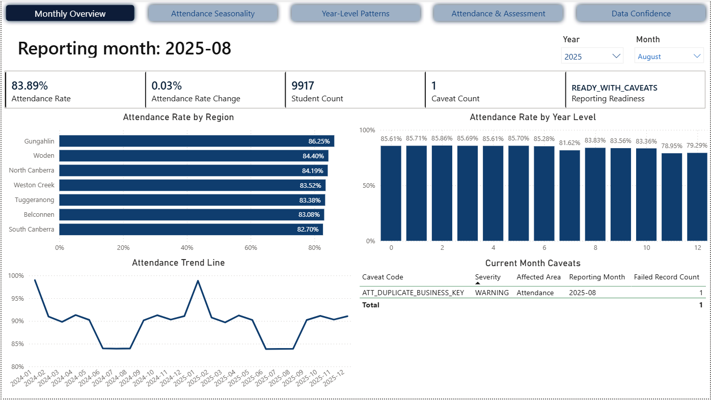
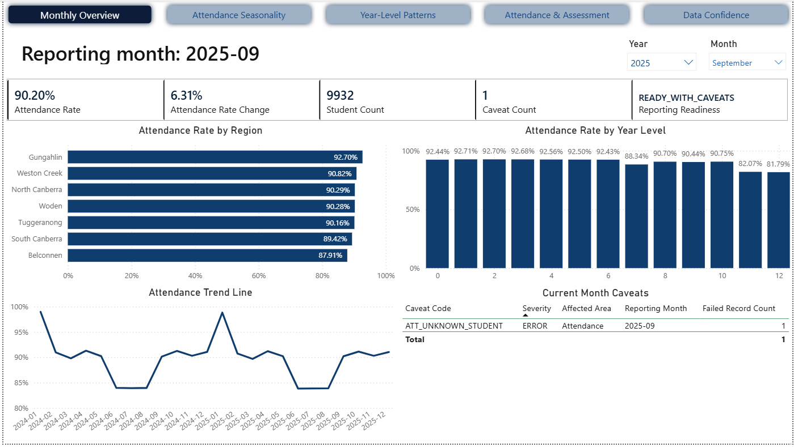

# Monthly Education Insights Briefs: August to November 2025

These briefs use the Monthly Overview dashboard screenshots as the primary evidence source. They complement the Power BI dashboard by turning monthly metrics into short stakeholder-facing findings, caveats, and suggested actions.

The figures are based on synthetic portfolio data and should not be interpreted as real student or school performance reporting.

## August 2025 Brief

### Reporting Period

| Field | Value |
|---|---|
| Reporting month | August 2025 |
| Prepared for | Education reporting and school operations stakeholders |
| Prepared by | Pipeline C portfolio project |
| Data status | Ready with caveats |

### Executive Summary

August remains part of the winter low-attendance period. Overall attendance is 83.89%, with a small increase of 0.03 percentage points from the prior month. The month is suitable for reporting, but one attendance duplicate caveat should be noted.

### Key Findings

| Finding | Evidence | Why it matters |
|---|---|---|
| Attendance remains low in winter | Attendance rate is 83.89% | August is still within the seasonal risk period identified in the dashboard. |
| Senior secondary year levels remain weaker | Years 11 and 12 are below 80% | Senior secondary attendance needs continued monitoring. |
| One quality caveat is present | `ATT_DUPLICATE_BUSINESS_KEY`, warning, 1 failed record | Reporting can proceed, but users should know one duplicate attendance record was identified. |

### Movement From Prior Period

| Metric | Current period | Prior period | Movement | Interpretation |
|---|---:|---:|---:|---|
| Attendance rate | 83.89% | 83.86% | +0.03 pp | Stable at a winter low point. |
| Student count | 9,917 | Not shown | Not assessed | Current month population is visible, but prior count is not available from the provided screenshot. |
| Caveat count | 1 | Not shown | Not assessed | One duplicate attendance warning is present this month. |

### Cohorts Or Schools Requiring Attention

| Area | Signal | Suggested follow-up |
|---|---|---|
| Years 11-12 | Attendance below 80% | Continue senior secondary monitoring and review engagement support. |
| South Canberra | Lowest regional attendance at 82.70% | Check whether the regional pattern persists into September. |

### Data Quality Caveats

| Caveat | Impact on reporting | Treatment |
|---|---|---|
| Duplicate attendance business key | One attendance record affected | Report with caveat; confirm duplicate handling is visible in the data-confidence page. |

Reporting confidence: reporting can proceed, but the caveat should be visible to dashboard users.

### Recommended Actions

| Action | Owner | Timing |
|---|---|---|
| Continue winter attendance monitoring for senior secondary cohorts | School operations/reporting stakeholders | Now |
| Review duplicate attendance caveat | Data/reporting team | Now |
| Compare September recovery against the winter trend | Reporting stakeholders | Next month |

### Plain-English Close

August confirms the expected winter attendance pressure. The data is usable for reporting, but the duplicate attendance caveat should be noted when presenting the figures.

## September 2025 Brief

### Reporting Period

| Field | Value |
|---|---|
| Reporting month | September 2025 |
| Prepared for | Education reporting and school operations stakeholders |
| Prepared by | Pipeline C portfolio project |
| Data status | Ready with caveats |

### Executive Summary

Attendance improves strongly in September as the winter period ends. The attendance rate rises to 90.20%, an increase of 6.31 percentage points from August. Reporting is suitable with caveats because one unknown-student attendance issue is recorded.

### Key Findings

| Finding | Evidence | Why it matters |
|---|---|---|
| Attendance recovers after winter | Attendance rate increases from 83.89% to 90.20% | This confirms the seasonal recovery pattern. |
| Regional attendance is broadly stronger | Most regions are close to or above 90% | The improvement is system-wide rather than isolated to one region. |
| One error-level caveat is present | `ATT_UNKNOWN_STUDENT`, 1 failed record | The month remains usable, but the excluded or unresolved record should be noted. |

### Movement From Prior Period

| Metric | Current period | Prior period | Movement | Interpretation |
|---|---:|---:|---:|---|
| Attendance rate | 90.20% | 83.89% | +6.31 pp | Strong post-winter recovery. |
| Student count | 9,932 | 9,917 | +15 | Small increase in reported student count. |
| Caveat count | 1 | 1 | 0 | Caveat volume is unchanged, but the caveat type changed. |

### Cohorts Or Schools Requiring Attention

| Area | Signal | Suggested follow-up |
|---|---|---|
| Years 11-12 | Attendance remains lower than other year levels | Continue senior secondary monitoring despite the monthly recovery. |
| Belconnen | Lowest regional attendance at 87.91% | Review whether local attendance recovery is slower than other regions. |

### Data Quality Caveats

| Caveat | Impact on reporting | Treatment |
|---|---|---|
| Unknown student in attendance data | One attendance record affected | Report with caveat and treat as a data-quality follow-up item. |

Reporting confidence: reporting can proceed with a caveat. The main attendance signal is strong enough to communicate, but the unknown-student issue should be disclosed.

### Recommended Actions

| Action | Owner | Timing |
|---|---|---|
| Confirm that September recovery continues in October | Reporting stakeholders | Next month |
| Review unknown-student attendance record | Data/reporting team | Now |
| Continue senior secondary attendance monitoring | School operations/reporting stakeholders | Ongoing |

### Plain-English Close

September shows a clear recovery from the winter low point. The data is ready for reporting with one caveat, and the main business message is that attendance improved substantially across the system.

## October 2025 Brief

### Reporting Period

| Field | Value |
|---|---|
| Reporting month | October 2025 |
| Prepared for | Education reporting and school operations stakeholders |
| Prepared by | Pipeline C portfolio project |
| Data status | Ready |

### Executive Summary

October continues the post-winter recovery. Attendance rises to 91.13%, up 0.93 percentage points from September. No current-month caveats are shown, so the month is ready for reporting.

### Key Findings

| Finding | Evidence | Why it matters |
|---|---|---|
| Attendance continues to improve | Attendance rate is 91.13% | October confirms that recovery after winter has been sustained. |
| Regional attendance is consistently strong | All regions are above 90% | The improvement is broad across regions. |
| No caveats are shown | Caveat count is 0 | Reporting confidence is higher than in August and September. |

### Movement From Prior Period

| Metric | Current period | Prior period | Movement | Interpretation |
|---|---:|---:|---:|---|
| Attendance rate | 91.13% | 90.20% | +0.93 pp | Continued improvement after September. |
| Student count | 9,947 | 9,932 | +15 | Small increase in reported student count. |
| Caveat count | 0 | 1 | -1 | Data confidence improved compared with September. |

### Cohorts Or Schools Requiring Attention

| Area | Signal | Suggested follow-up |
|---|---|---|
| Years 11-12 | Lower than most other year levels, despite improvement | Continue targeted monitoring for senior secondary attendance. |
| Belconnen | Lowest regional attendance at 90.55% | Monitor but no immediate caveat is indicated. |

### Data Quality Caveats

| Caveat | Impact on reporting | Treatment |
|---|---|---|
| None shown for the current month | No caveat impact identified from the screenshot | Report as ready. |

Reporting confidence: reporting can proceed without current-month caveats.

### Recommended Actions

| Action | Owner | Timing |
|---|---|---|
| Use October as a clean post-winter reporting month | Reporting stakeholders | Now |
| Keep senior secondary attendance visible in routine reporting | School operations/reporting stakeholders | Ongoing |
| Compare November movement against October to identify late-year softening | Reporting stakeholders | Next month |

### Plain-English Close

October is a strong reporting month. Attendance improved again, regional results are broadly consistent, and no caveats are shown for the current month.

## November 2025 Brief

### Reporting Period

| Field | Value |
|---|---|
| Reporting month | November 2025 |
| Prepared for | Education reporting and school operations stakeholders |
| Prepared by | Pipeline C portfolio project |
| Data status | Ready with caveats |

### Executive Summary

November shows a small softening after October. Attendance is 90.30%, down 0.82 percentage points from the prior month. Reporting remains suitable, but one assessment score caveat should be noted.

### Key Findings

| Finding | Evidence | Why it matters |
|---|---|---|
| Attendance remains above 90% | Attendance rate is 90.30% | Attendance remains stronger than the winter period. |
| Attendance declined from October | Attendance rate change is -0.82 pp | This suggests late-year attendance should continue to be monitored. |
| One assessment caveat is present | `ASM_INVALID_SCORE`, 1 failed record | Assessment interpretation should note that one invalid score was identified. |

### Movement From Prior Period

| Metric | Current period | Prior period | Movement | Interpretation |
|---|---:|---:|---:|---|
| Attendance rate | 90.30% | 91.13% | -0.82 pp | Slight decline after October. |
| Student count | 9,962 | 9,947 | +15 | Small increase in reported student count. |
| Caveat count | 1 | 0 | +1 | Data confidence is slightly lower than October due to one assessment caveat. |

### Cohorts Or Schools Requiring Attention

| Area | Signal | Suggested follow-up |
|---|---|---|
| Years 11-12 | Attendance remains lower than most other year levels | Continue senior secondary monitoring before end-of-year reporting. |
| Belconnen | Lowest regional attendance at 88.25% | Review whether the regional decline requires follow-up. |
| Assessment data | Invalid score caveat | Confirm invalid assessment record is excluded or clearly caveated. |

### Attendance And Assessment Insight

The broader dashboard shows that higher attendance bands are associated with stronger assessment outcomes. For November, the assessment caveat means any assessment interpretation should acknowledge that one invalid score was identified and treated as a data-quality issue.

### Data Quality Caveats

| Caveat | Impact on reporting | Treatment |
|---|---|---|
| Invalid assessment score | One assessment record affected | Report with caveat; ensure assessment figures exclude or disclose the invalid score treatment. |

Reporting confidence: reporting can proceed with a caveat. The attendance story remains clear, but assessment-related reporting should disclose the invalid score issue.

### Recommended Actions

| Action | Owner | Timing |
|---|---|---|
| Monitor late-year attendance softening | School operations/reporting stakeholders | Now |
| Review invalid assessment score handling | Data/reporting team | Now |
| Keep senior secondary attendance as a standing item in monthly reporting | Reporting stakeholders | Ongoing |

### Plain-English Close

November remains suitable for reporting, with attendance above 90%. The main caution is one assessment data caveat, which should be disclosed when discussing assessment-related results.

## Dashboard Pages Used

| Dashboard page | Used for |
|---|---|
| Monthly Overview | Overall movement, student count, readiness, regional attendance, year-level attendance, and current-month caveats |
| Attendance Seasonality | Interpretation of winter decline and post-winter recovery |
| Year-Level Patterns | Cohort and senior secondary attendance risk context |
| Attendance And Assessment | Context for interpreting assessment caveats and attendance-assessment association |
| Data Confidence | Reporting readiness and caveat interpretation |

## Notes For Portfolio Review

These briefs are based on synthetic data generated for a portfolio project. The purpose is to demonstrate monthly reporting, stakeholder communication, data quality caveats, and Power BI storytelling. Student-level identifiers are not shown in stakeholder-facing outputs.
