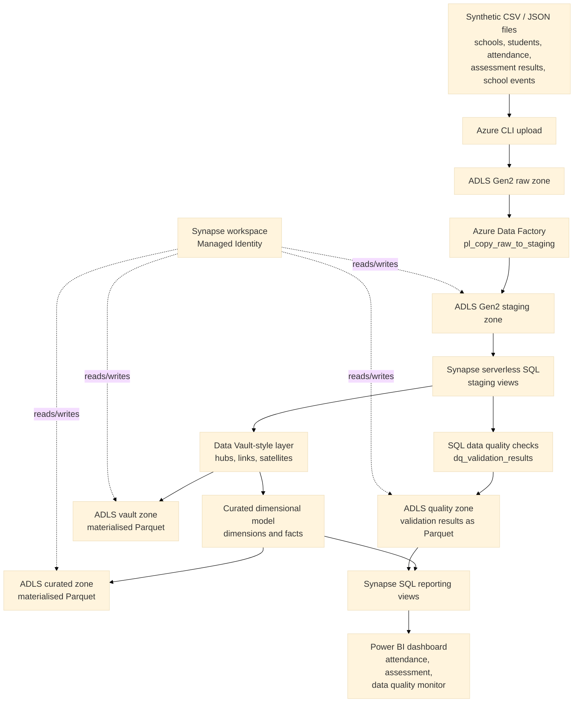
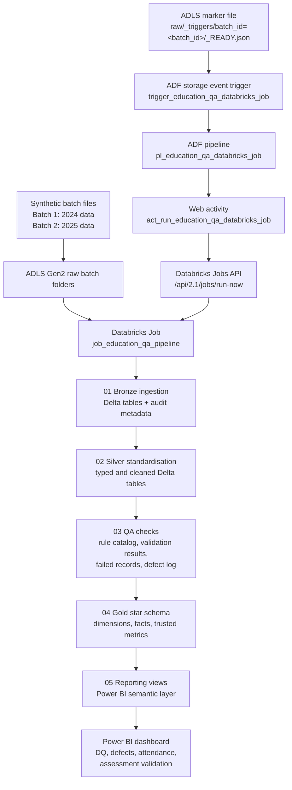

# Architecture

## Overview

This project implements a small Azure education data lakehouse using synthetic school, student, attendance, assessment, and school event data.

The original lakehouse architecture uses ADLS Gen2 for lake storage, Azure Data Factory for raw-to-staging movement, Synapse serverless SQL for staging, quality checks, lakehouse materialisation, and reporting views, and Power BI for dashboarding.

The Databricks QA extension adds Azure Databricks, Delta Lake, Unity Catalog, Databricks Jobs, an ADF event-trigger wrapper, and Power BI reporting views. This extension demonstrates production-style QA orchestration across Bronze, Silver, QA, Gold, and reporting layers.

## Architecture Diagram



## Databricks QA Extension Architecture



The Databricks Job is the main orchestrator for the ETL and QA workflow. ADF is used as an enterprise wrapper that listens for a `_READY.json` marker file and triggers the existing Databricks Job through the Databricks Jobs API. ADF does not own the transformation logic.

The implemented ADF wrapper uses this event pattern:

```text
raw/_triggers/batch_id=<batch_id>/_READY.json
```

When the marker file is created, `trigger_education_qa_databricks_job` starts `pl_education_qa_databricks_job`. The pipeline's Web activity calls the Databricks Jobs `run-now` API and passes the pipeline parameters `environment`, `batch_id`, and `run_mode`.

## Implemented Azure Resources

| Resource | Name | Purpose |
|---|---|---|
| Resource group | `rg-act-education-lakehouse-dev` | Groups all Azure resources for the project |
| Storage account | `stactedulakehousechien` | Stores lakehouse files |
| ADLS Gen2 file system | `education-data-lake` | Main data lake container |
| Azure Data Factory | Project ADF resource | Orchestrates raw-to-staging copy pipeline |
| ADF linked service | `ls_adls_education_lakehouse` | Connects ADF to ADLS Gen2 |
| ADF pipeline | `pl_copy_raw_to_staging` | Copies raw files to staging folders |
| Synapse workspace | `syn-act-education-lakehouse-dev` | Hosts serverless SQL objects |
| Synapse database | `act_education_lakehouse` | Contains staging, quality, vault, curated, and reporting SQL objects |
| Power BI report | `powerbi/pipeline_a_synapse_baseline/lakehouse_dashboard.pbix` | Presents attendance, assessment, and data quality outputs |
| Databricks workspace | `dbw-edu-qa-dev` | Runs notebooks, Jobs, Delta tables, and reporting views |
| Databricks catalog | `dbw_edu_qa_dev` | Unity Catalog catalog for Bronze, Silver, QA, Gold, and reporting schemas |
| Databricks Job | `job_education_qa_pipeline` | Runs Bronze, Silver, QA, Gold, and reporting notebooks in dependency order |
| Data Factory resource | `adf-edu-qa-dev` | Hosts the implemented event-trigger wrapper |
| ADF pipeline | `pl_education_qa_databricks_job` | Calls the Databricks Job through a Web activity |
| ADF activity | `act_run_education_qa_databricks_job` | Calls the Databricks Jobs `run-now` API |
| ADF storage event trigger | `trigger_education_qa_databricks_job` | Starts the wrapper when `_READY.json` is created under `raw/_triggers/` |
| ADF trigger marker | `raw/_triggers/batch_id=<batch_id>/_READY.json` | Indicates that a source batch is ready for the Databricks Job |

## Implemented Data Flow

1. Synthetic CSV and JSON files are generated locally.
2. Source files are uploaded to the ADLS Gen2 raw zone using Azure CLI.
3. Azure Data Factory copies files from raw folders to staging folders.
4. Synapse serverless SQL staging views read staged files using a Managed Identity-backed external data source.
5. SQL data quality checks create a validation summary.
6. Quality results are materialised to the ADLS quality zone as Parquet.
7. Lightweight Data Vault-style hubs, links, and satellites are materialised to the ADLS vault zone as Parquet.
8. Curated dimensions and facts are materialised to the ADLS curated zone as Parquet.
9. Synapse reporting views expose Power BI-ready attendance, assessment, and quality metrics.
10. Power BI imports the reporting views and provides overview and detail pages.

## Databricks QA Data Flow

1. Batch 1 and Batch 2 synthetic data are uploaded to ADLS raw folders using date-based `batch_id` partitions.
2. The Databricks Job runs `01_ingest_raw_to_bronze` to create Bronze Delta tables with audit metadata, including `batch_id`, `run_id`, `source_file_name`, and `bronze_record_id`.
3. `02_transform_bronze_to_silver` standardises data types and creates cleaned Silver Delta tables.
4. `03_run_data_quality_checks` applies 11 QA rules and writes `qa.dq_validation_results`, `qa.dq_failed_records`, and `qa.defect_log`.
5. `04_build_gold_reporting_tables` excludes invalid records from trusted metrics and creates a production-style Gold star schema with dimensions and facts.
6. `05_create_reporting_views` creates business-facing views in the `reporting` schema from the Gold facts and dimensions for Power BI.
7. Power BI imports the reporting views and validates data quality, defect evidence, attendance reporting, and assessment reporting.
8. The ADF wrapper starts the same Databricks Job when a marker file is created at `raw/_triggers/batch_id=<batch_id>/_READY.json`.
9. The Batch 2 incremental ADF wrapper run was tested successfully and captured as evidence.

## Lakehouse Folder Structure

```text
education-data-lake/
  raw/
    schools/
    students/
    attendance/
    assessment_results/
    school_events/
    _triggers/
      batch_id=2026-01-15/
        _READY.json
  bronze/
  silver/
  gold/
  qa/
  reporting/
  staging/
    stg_schools/
    stg_students/
    stg_attendance/
    stg_assessment_results/
    stg_school_events/
  quality/
    validation_results/
  vault/
    hubs/
    links/
    satellites/
  curated/
    dimensions/
    facts/
```

## Security and Access

Synapse serverless SQL uses the Synapse workspace Managed Identity to access ADLS Gen2 through the external data source `education_lake`.

This avoids embedding storage keys in SQL scripts and makes Power BI access through Synapse reporting views cleaner.

## Scope Notes

- The original synthetic files are uploaded to the raw zone using Azure CLI.
- Azure Data Factory demonstrates the ingestion/orchestration pattern by copying raw files into the staging zone.
- Databricks Jobs are the primary orchestrator for the Databricks QA extension.
- The ADF event trigger is a lightweight wrapper that starts the Databricks Job after a `_READY.json` marker file is uploaded under `raw/_triggers/`.
- The project is batch-oriented and intentionally small.
- Production extensions would include private endpoints, Key Vault, CI/CD, monitoring, alerting, metadata-driven ingestion, and stronger governance controls.

## Evidence

| Evidence | Location |
|---|---|
| Resource group screenshot | `images/pipeline_a_synapse_baseline/resource_group.png` |
| Storage account screenshot | `images/pipeline_a_synapse_baseline/storage_account.png` |
| Storage folder screenshot | `images/pipeline_a_synapse_baseline/storage_folders.png` |
| ADF resource screenshot | `images/pipeline_a_synapse_baseline/adf_resource.png` |
| ADF datasets screenshot | `adf/pipeline_screenshots/adf_datasets.png` |
| ADF pipeline canvas screenshot | `adf/pipeline_screenshots/adf_pipeline_canvas.png` |
| ADF successful run screenshot | `adf/pipeline_screenshots/adf_pipeline_success.png` |
| Databricks Batch 1 job run screenshot | `images/pipeline_b_databricks_qa/databricks_job_batch1_initial.png` |
| Databricks Batch 2 job run screenshot | `images/pipeline_b_databricks_qa/databricks_job_batch2_incremental.png` |
| ADF Databricks wrapper run screenshot | `images/pipeline_b_databricks_qa/adf_pipeline_debug_success.png` |
| Synapse resource screenshot | `images/pipeline_a_synapse_baseline/synapse_resource.png` |
| Synapse query screenshot | `images/pipeline_a_synapse_baseline/synapse_query.png` |
| Data quality result screenshot | `images/pipeline_a_synapse_baseline/dq_validation_results.png` |
| Power BI report | `powerbi/pipeline_a_synapse_baseline/lakehouse_dashboard.pbix` |
| Power BI screenshots | `powerbi/pipeline_a_synapse_baseline/screenshots/` |
